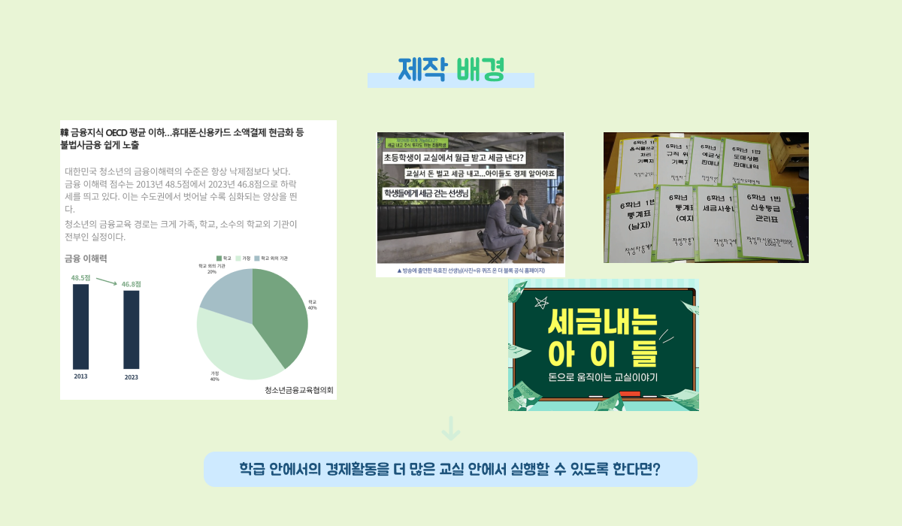
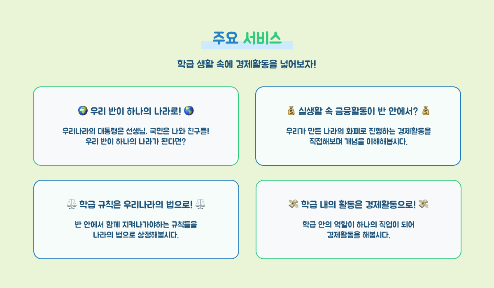
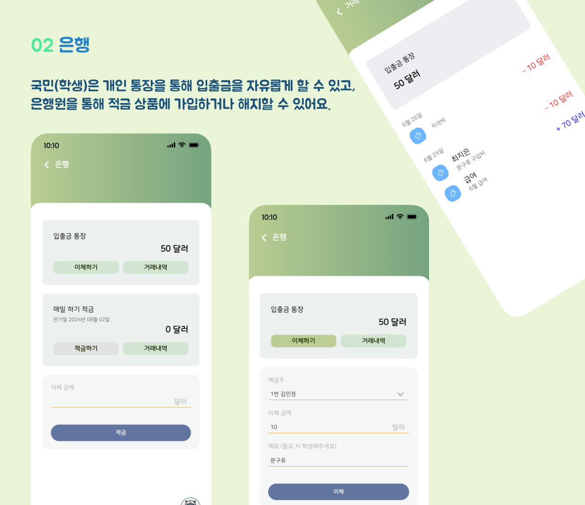
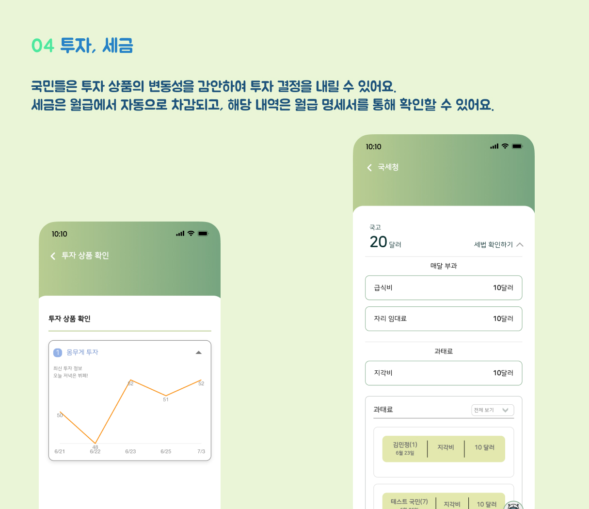
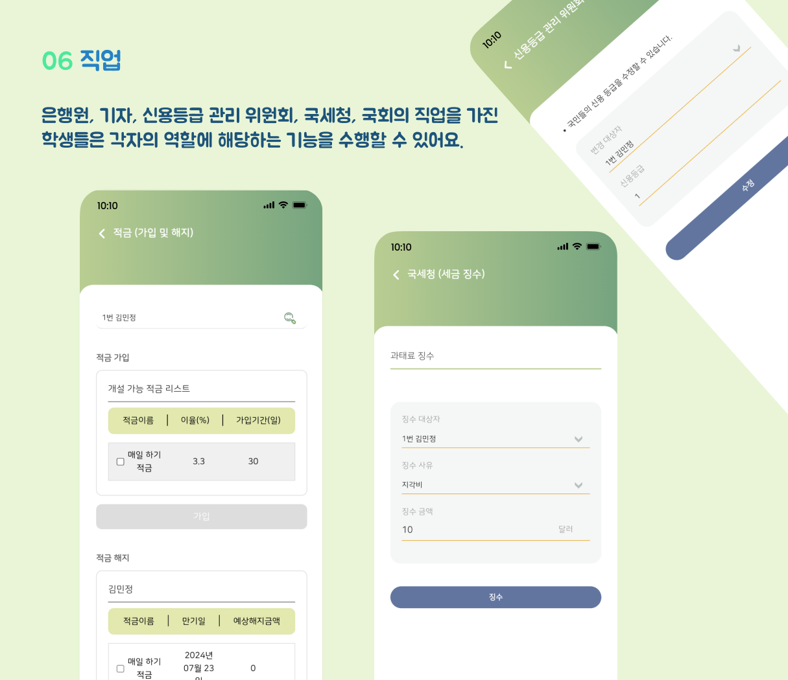
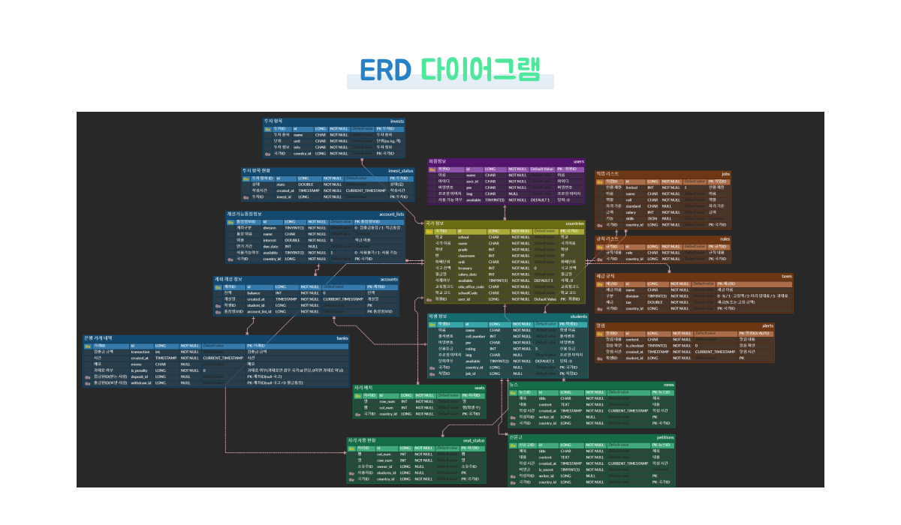
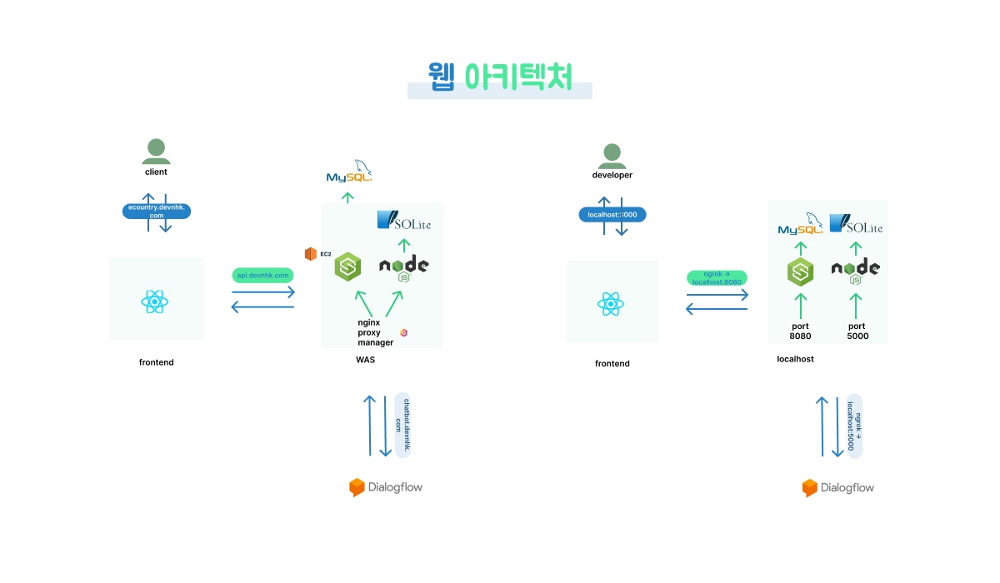
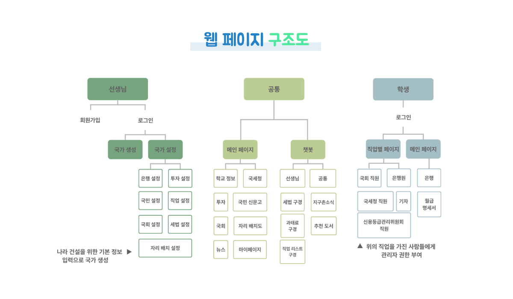
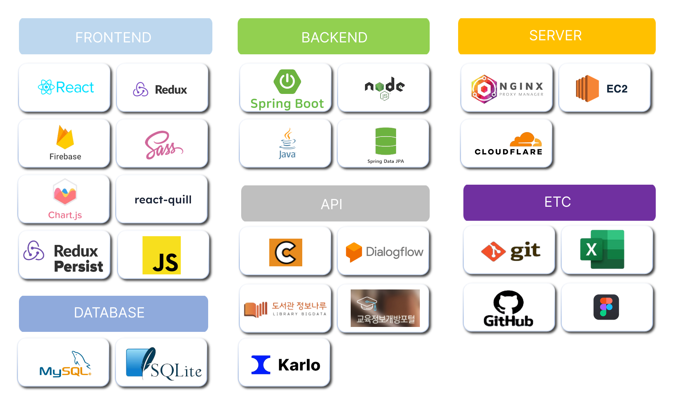

.png)

.png)

***

 

 

## 사용 기술

<!--
### 프론트엔드
| JavaScript | React    | Figma    | 
| :--------: | :---:    | :---:    | 
|   ![js]    | ![react] | ![figma] | 

### 백엔드
|  Java   |  SpringBoot   | JavaScript |  Node   |
| :-----: | :-----------: | :--------: | :-----: |
| ![java] | ![springboot] |   ![js]    | ![node] |
-->

 

[프론트엔 깃허브]([https://github.com/cje206/ecountry-back.git](https://github.com/MinJeonng/ecountry-front))

 

## 멤버

### 프론트엔드

|  |  |  |
| :---------------------------------------------------------------------------------------: | :----------------------------------------------------------------------------------------: | :-----------------------------------------------------------------------------------------: |
|                         [민정](https://github.com/MinJeonng)                         |                          [지혜](https://github.com/Jihye8)                          |                             [시영](https://github.com/cci0)                             |

### 백엔드

|  |  |  
| :---------------------------------------------------------------------------------------: | :---------------------------------------------------------------------------------------: | :---------------------------------------------------------------------------------------: | 
|                             [지은](https://github.com/cje206)                              |                            [현경](https://github.com/Hyunkyung-Nam)                             |                            [명규](https://github.com/gh9727)                             

[js]: /images/javascript.svg
[react]: /images/react.svg
[figma]: /images/figma.svg
[java]: /images/java.svg
[node]: /images/node.svg
[springboot]: /images/springboot.svg
